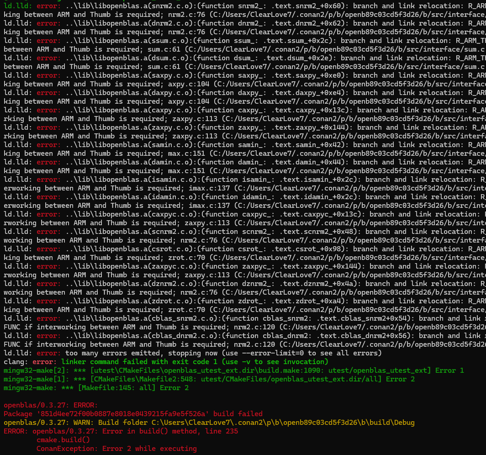
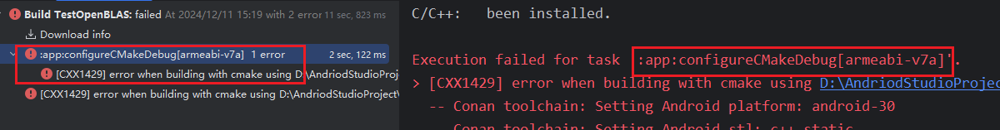

# 基于 OpenBLAS 的坐标系变换

## 任务描述

测试在**移动端**的 CPU 上，基于 OpenBLAS，一秒能完成的 **世界坐标系** 到 屏幕像素坐标系 的变换的次数。

## 什么是 OpenBLAS？

OpenBLAS 是一个高性能的矩阵运算库，主要用于提供基础线性代数操作（Basic Linear Algebra Subprograms, **BLAS**）和部分线性代数库（**LAPACK**）的实现。在同样的硬件平台下，不额外花费硬件，不使用 CPU 和加速部件，就能获得很好的计算受益。它提供了多线程支持，可以支持多线程运算。此外，它支持多个操作系统，比如 Linux， Windows， maxOS。

其他类似的库还有 Intel MKL， ATLAS 和 Eigen。

Intel MKL 是专为 Intel CPU 提供的优化，是 Intel 提供的商业库；ATLAS 是另一个 BLAS 的实现； Eigen 是 C++ 的模板库，在大规模矩阵计算性能上可能不如 OpenBLAS。

## 环境

1. Visual Studio 2022 
2. OpenBLAS-0.3.28-x64

## 环境配置

1. 在[OpenBLAS官网](https://github.com/OpenMathLib/OpenBLAS/releases)上下载 Release 最新版本，OpenBLAS-0.3.28-x64。


2. 下载好后，创建一个 VS2022 控制台应用，创建一个文件夹，命名为 OpenBLAS-0.3.28，将压缩包解压到该文件夹下，将外面的两个文件拖入到 lib 文件夹中（也可以不拖，只是下面设置路径的时候略有不一样）。


3. 配置项目的**附加包含目录**，附加库目录和**附加依赖项**。这里的路径可根据自己的项目配置灵活修改，本项目是在解决方案下新建文件夹 Dependences（和项目同级），本意将未来所有配置文件放在该文件夹下。


4. 将 dll 配置到项目运行路径中。项目运行是在整个解决方案下的 x64 里面，而不是单个项目的 x64 里面。下面有两种方法将 dll 配置到项目运行路径中。还可参考[解决方案链接](https://www.cnblogs.com/xiaxuexiaoab/p/14948324.html)。

​	方法1：将 OpenBLAS-0.3.28/bin 文件夹下的 dll 复制到解决方案的 x64/Debug 目录下。

​	

​	方法2：在项目配置中设置调试环境。本项目设置的是 `PATH=$(SolutionDir)Dependences/OpenBLAS-0.3.28/bin`。


5. 测试编译运行。输入以下代码，能够看到控制台输出，即成功配置。

```c++
#include <iostream>
#include <chrono>
#include <cblas.h>

// 假设世界坐标到屏幕坐标的变换使用 4x4 矩阵乘法
void multiplyMatrix(const float* vMatrixA, const float* vMatrixB, float* pResultMatrixC, int vSize)
{
    cblas_sgemm(CblasColMajor, CblasNoTrans, CblasNoTrans,
        vSize, vSize, vSize, 1.0f, vMatrixA, vSize, vMatrixB, vSize, 0.0f, pResultMatrixC, vSize);
}

int main()
{
    const int MatrixSize = 4;       // 使用 4x4 矩阵
    const int Iterations = 1000000; // 每秒进行 100 万次变换

    // 创建 4x4 矩阵，初始化为单位矩阵
    float pMatrixA[MatrixSize * MatrixSize] = {
        1.0f, 0.0f, 0.0f, 0.0f,
        0.0f, 1.0f, 0.0f, 0.0f,
        0.0f, 0.0f, 1.0f, 0.0f,
        0.0f, 0.0f, 0.0f, 1.0f
    };
    float pMatrixB[MatrixSize * MatrixSize] = {
        1.0f, 0.0f, 0.0f, 0.0f,
        0.0f, 1.0f, 0.0f, 0.0f,
        0.0f, 0.0f, 1.0f, 0.0f,
        0.0f, 0.0f, 0.0f, 1.0f
    };
    float pResultMatrix[MatrixSize * MatrixSize]; // 结果矩阵

    auto StartTime = std::chrono::high_resolution_clock::now();
    for (size_t i = 0; i < Iterations; ++i) 
    {
        multiplyMatrix(pMatrixA, pMatrixB, pResultMatrix, MatrixSize); // 进行矩阵乘法运算
    }
    auto EndTime = std::chrono::high_resolution_clock::now();
    std::chrono::duration<double> Duration = EndTime - StartTime;

    double TransformsPerSecond = Iterations / Duration.count();
    std::cout << "每秒完成的变换次数: " << TransformsPerSecond << std::endl;
    return 0;
}
```


如果需要复习线性代数的基本知识，Gilbert Strang 教授在 MIT OpenCourseWare [（此处）](https://ocw.mit.edu/resources/res-18-010-a-2020-vision-of-linear-algebra-spring-2020/)或 YouTube [（此处）](https://www.youtube.com/playlist?list=PLUl4u3cNGP61iQEFiWLE21EJCxwmWvvek)上制作的一组 6 个 20 分钟的讲座视频可能会有所帮助。


## 参考资料

1. [OpenBLAS官方Wiki文档](https://github.com/OpenMathLib/OpenBLAS/wiki/Document)
2. [上海交大超算平台用户手册（Linux）](https://docs.hpc.sjtu.edu.cn/app/compilers_and_languages/openblas.html)


## Conan配置注意事项

### Conan 命令生成工具链文件

`conan install . -pr:h=android-studio -s build_type=Debug -s arch=armv7 --output-folder=build/x86 --build=missing -c tools.cmake.cmake_layout:build_folder_vars=['settings.arch']` 这两个命令通常在项目的根目录下执行，也就是包含 `conanfile.py` 或 `conanfile.txt` 文件的目录。这个文件定义了项目所需的依赖和配置。

**正确设置了 Conan 配置文件**：

- `-pr:h=android` 表示指定主机配置文件，应该指向一个定义了 Android 构建环境的 Conan profile（配置文件）。
- 这个 profile 文件通常需要手动创建或从 Conan 提供的模板中生成。
### 检查生成的文件
  - Conan 将下载和构建所有所需的依赖项（如果需要）。
  - 成功运行后，生成的文件会包含：
    - `conan_toolchain.cmake`：用于设置 CMake 工具链。
    - `conanbuildinfo.cmake`（如果启用）。


## 踩坑

### 编译错误之 `if given arguments: "hwaddress" "IN_LIST" "ANDROID_SANITIZE"` 

根据chatgpt的回答来看，原因大致总结如下：

1. 当前使用的 CMake 策略未启用对 `IN_LIST` 操作符的支持，因此出现错误。

2. **`IN_LIST` 的问题**：CMake 3.2 引入了 `IN_LIST` 操作符，但需要在 `cmake_policy` 中启用 **`CMP0057`**  策略才能正常使用。如果策略未启用，CMake 会认为 `IN_LIST` 是无效参数。默认情况下，CMake 在较低兼容模式下运行。如果没有显式设置策略，CMake 将使用较旧的行为（OLD），导致新功能无法正常工作。

解决方式：

- 设置 `CMP0057` 策略为 NEW。在你的 `CMakeLists` 文件顶部添加以下内容

```cmake
cmake_policy(SET CMP0057 NEW)
```

这会显式启用 `CMP0057` 策略，支持 `IN_LIST` 操作符。这个文件通常在自己的 ndk 路径下 `/build/cmake/flags.cmake` 中，例如本机的文件在路径 `C:\Users\ClearLove7\AppData\Local\Android\Sdk\ndk\27.0.12077973\build\cmake` 下。

### OpenBLAS安装之构建armeabi-v7a链接错误

OpenBLAS 常理来说构建的系统有 `x86 x86_64 armv8 armv7` ，但是在构建过程中，有且仅有 armv7 出现了链接错误，并且在整个项目的构建中，就缺少一个 armeabi-v7a 构建失败，于是就想跳过这个 armv7版本的 OpenBLAS 的构建。





解决方式：

在 build.gradle.kts 中添加最新的 ndk 编译路径（[参考链接](https://stackoverflow.com/questions/54476308/support-to-64-bit-gives-error-on-adding-ndk-abifilters-in-build-gradle)），如下所示：

```gradle
ndk {
    abiFilters.add("x86")
    abiFilters.add("x86_64")
    abiFilters.add("arm64-v8a")
}
```

之前的版本的写法都不管用，还真废了一番功夫。

### conan--build的参数有哪些

在使用 **Conan** 时，`--build` 参数用于控制是否重新构建某些包或其依赖项。`--build` 主要用于在执行 `conan install` 时决定如何处理已缓存的包。

以下是 `--build` 参数的几种常见用法：

#### 1. **`--build=<package>`**

指定要重新构建的特定包。如果你希望重新构建某个特定的包，可以指定包名。Conan 会重新构建这个包及其所有的依赖项。

```
conan install . --build=openblas/0.3.27
```

这个命令会强制重新构建 `openblas/0.3.27` 包，并安装它。

#### 2. **`--build=missing`**

这个选项用于指示 Conan 重新构建那些在缓存中缺失的包。这对于从未构建过的包或已删除的包特别有用。

```
conan install . --build=missing
```

如果某个包在本地缓存中没有，Conan 会从源代码重新构建它。

#### 3. **`--build=outdated`**

此选项用于重新构建所有有更新的依赖项。如果你在 `conanfile.txt` 或 `conanfile.py` 中更新了某个包的版本，使用这个选项会强制重新构建任何过时的包。

```
conan install . --build=outdated
```

此命令会检查所有包，并重新构建那些已经更新的包。

#### 4. **`--build=all`**

此选项强制重新构建所有包，无论它们是否在缓存中。这通常用于确保所有依赖项都被重新编译，并且没有使用缓存的旧版本。

```
conan install . --build=all
```

这个命令会重新构建所有依赖项，并忽略缓存中的任何现有包。

#### 5. **`--build=None`**

有时，`--build=None` 也可以作为参数来防止重新构建包，但这通常不是直接指定的，而是与其他选项一起使用。

```
conan install . --build=None
```

此命令不会重新构建任何包，且只会安装已经缓存的包（如果可用）。

#### 6. **`--build=never`**

类似于 `--build=None`，但是这是在某些版本的 Conan 中使用的参数。它明确指示 Conan **不** 进行任何构建操作，直接使用缓存的包。

```
conan install . --build=never
```

这会忽略任何构建操作，直接使用已有的缓存包。

#### 总结：

- `--build=<package>`: 重新构建指定的包。 e.g. `--build=openblas/0.3.27` 
- `--build=missing`: 仅当包在本地缓存中缺失时重新构建。
- `--build=outdated`: 重新构建过时的包（有更新的版本）。
- `--build=all`: 重新构建所有包。
- `--build=None` 或 `--build=never`: 不进行构建操作，直接使用缓存包。

使用 `--build` 参数可以帮助你控制是否使用现有的包或者强制重新构建特定的依赖项，适应不同的开发和构建需求。


### 在缓存包中的 build/Release(或者Debug)/generators 下的conan_toolchain.cmake文件解读

```cmake
include_guard()
message(STATUS "Using Conan toolchain: ${CMAKE_CURRENT_LIST_FILE}")
set(CMAKE_EXE_LINKER_FLAGS "${CMAKE_EXE_LINKER_FLAGS} -Wl,--support-interworking")
if(${CMAKE_VERSION} VERSION_LESS "3.15")
    message(FATAL_ERROR "The 'CMakeToolchain' generator only works with CMake >= 3.15")
endif()

tools.cmake.cmaketoolchain:user_toolchain

message(STATUS "Conan toolchain: Setting Android platform: android-30")
set(ANDROID_PLATFORM android-30)
message(STATUS "Conan toolchain: Setting Android stl: c++_static")
set(ANDROID_STL c++_static)
message(STATUS "Conan toolchain: Setting Android abi: armeabi-v7a")
set(ANDROID_ABI armeabi-v7a)
include("C://Users//ClearLove7//AppData//Local//Android//Sdk//ndk//27.0.12077973/build/cmake/android.toolchain.cmake")

message(STATUS "Conan toolchain: Setting CMAKE_POSITION_INDEPENDENT_CODE=ON (options.fPIC)")
set(CMAKE_POSITION_INDEPENDENT_CODE ON CACHE BOOL "Position independent code")

function(conan_modify_std_watch variable access value current_list_file stack)
    set(conan_watched_std_variable "17")
    if (${variable} STREQUAL "CMAKE_C_STANDARD")
        set(conan_watched_std_variable "")
    endif()
    if ("${access}" STREQUAL "MODIFIED_ACCESS" AND NOT "${value}" STREQUAL "${conan_watched_std_variable}")
        message(STATUS "Warning: Standard ${variable} value defined in conan_toolchain.cmake to ${conan_watched_std_variable} has been modified to ${value} by ${current_list_file}")
    endif()
    unset(conan_watched_std_variable)
endfunction()

message(STATUS "Conan toolchain: C++ Standard 17 with extensions OFF")
set(CMAKE_CXX_STANDARD 17)
set(CMAKE_CXX_EXTENSIONS OFF)
set(CMAKE_CXX_STANDARD_REQUIRED ON)
variable_watch(CMAKE_CXX_STANDARD conan_modify_std_watch)

foreach(config IN LISTS CMAKE_CONFIGURATION_TYPES)
    string(TOUPPER ${config} config)
    if(DEFINED CONAN_CXX_FLAGS_${config})
      string(APPEND CMAKE_CXX_FLAGS_${config}_INIT " ${CONAN_CXX_FLAGS_${config}}")
    endif()
    if(DEFINED CONAN_C_FLAGS_${config})
      string(APPEND CMAKE_C_FLAGS_${config}_INIT " ${CONAN_C_FLAGS_${config}}")
    endif()
    if(DEFINED CONAN_SHARED_LINKER_FLAGS_${config})
      string(APPEND CMAKE_SHARED_LINKER_FLAGS_${config}_INIT " ${CONAN_SHARED_LINKER_FLAGS_${config}}")
    endif()
    if(DEFINED CONAN_EXE_LINKER_FLAGS_${config})
      string(APPEND CMAKE_EXE_LINKER_FLAGS_${config}_INIT " ${CONAN_EXE_LINKER_FLAGS_${config}}")
    endif()
endforeach()

if(DEFINED CONAN_CXX_FLAGS)
  string(APPEND CMAKE_CXX_FLAGS_INIT " ${CONAN_CXX_FLAGS}")
endif()
if(DEFINED CONAN_C_FLAGS)
  string(APPEND CMAKE_C_FLAGS_INIT " ${CONAN_C_FLAGS}")
endif()
if(DEFINED CONAN_SHARED_LINKER_FLAGS)
  string(APPEND CMAKE_SHARED_LINKER_FLAGS_INIT " ${CONAN_SHARED_LINKER_FLAGS}")
endif()
if(DEFINED CONAN_EXE_LINKER_FLAGS)
  string(APPEND CMAKE_EXE_LINKER_FLAGS_INIT " ${CONAN_EXE_LINKER_FLAGS}")
endif()

# Definition of extra CMake variables from tools.cmake.cmaketoolchain:extra_variables

# Blocks after this one will not be added when running CMake try/checks

get_property( _CMAKE_IN_TRY_COMPILE GLOBAL PROPERTY IN_TRY_COMPILE )
if(_CMAKE_IN_TRY_COMPILE)
    message(STATUS "Running toolchain IN_TRY_COMPILE")
    return()
endif()

if(EXISTS "${CMAKE_CURRENT_LIST_DIR}/conan_cmakedeps_paths.cmake")
  message(STATUS "Conan toolchain: Including CMakeDeps generated conan_find_paths.cmake")
  include("${CMAKE_CURRENT_LIST_DIR}/conan_cmakedeps_paths.cmake")
else()

set(CMAKE_FIND_PACKAGE_PREFER_CONFIG ON)

list(PREPEND CMAKE_MODULE_PATH ${CMAKE_CURRENT_LIST_DIR})

list(PREPEND CMAKE_PREFIX_PATH ${CMAKE_CURRENT_LIST_DIR} )

if(NOT DEFINED CMAKE_FIND_ROOT_PATH_MODE_PACKAGE OR CMAKE_FIND_ROOT_PATH_MODE_PACKAGE STREQUAL "ONLY")
    set(CMAKE_FIND_ROOT_PATH_MODE_PACKAGE "BOTH")
endif()
if(NOT DEFINED CMAKE_FIND_ROOT_PATH_MODE_PROGRAM OR CMAKE_FIND_ROOT_PATH_MODE_PROGRAM STREQUAL "ONLY")
    set(CMAKE_FIND_ROOT_PATH_MODE_PROGRAM "BOTH")
endif()
if(NOT DEFINED CMAKE_FIND_ROOT_PATH_MODE_LIBRARY OR CMAKE_FIND_ROOT_PATH_MODE_LIBRARY STREQUAL "ONLY")
    set(CMAKE_FIND_ROOT_PATH_MODE_LIBRARY "BOTH")
endif()
if(NOT DEFINED CMAKE_FIND_ROOT_PATH_MODE_INCLUDE OR CMAKE_FIND_ROOT_PATH_MODE_INCLUDE STREQUAL "ONLY")
    set(CMAKE_FIND_ROOT_PATH_MODE_INCLUDE "BOTH")
endif()
endif()

if (DEFINED ENV{PKG_CONFIG_PATH})
set(ENV{PKG_CONFIG_PATH} "${CMAKE_CURRENT_LIST_DIR};$ENV{PKG_CONFIG_PATH}")
else()
set(ENV{PKG_CONFIG_PATH} "${CMAKE_CURRENT_LIST_DIR};")
endif()

message(STATUS "Conan toolchain: Setting BUILD_SHARED_LIBS = OFF")
set(BUILD_SHARED_LIBS OFF CACHE BOOL "Build shared libraries")


########## 'output_dirs' block #############
# Definition of CMAKE_INSTALL_XXX folders

set(CMAKE_INSTALL_PREFIX "C:/Users/ClearLove7/.conan2/p/b/openbe04dd786c0863/p")
set(CMAKE_INSTALL_BINDIR "bin")
set(CMAKE_INSTALL_SBINDIR "bin")
set(CMAKE_INSTALL_LIBEXECDIR "bin")
set(CMAKE_INSTALL_LIBDIR "lib")
set(CMAKE_INSTALL_INCLUDEDIR "include")
set(CMAKE_INSTALL_OLDINCLUDEDIR "include")

set(BUILD_STATIC_LIBS ON CACHE BOOL "Variable BUILD_STATIC_LIBS conan-toolchain defined")
set(BUILD_SHARED_LIBS "False" CACHE STRING "Variable BUILD_SHARED_LIBS conan-toolchain defined")
set(BUILD_TESTING OFF CACHE BOOL "Variable BUILD_TESTING conan-toolchain defined")
set(NOFORTRAN ON CACHE BOOL "Variable NOFORTRAN conan-toolchain defined")
set(C_LAPACK ON CACHE BOOL "Variable C_LAPACK conan-toolchain defined")
set(BUILD_WITHOUT_LAPACK OFF CACHE BOOL "Variable BUILD_WITHOUT_LAPACK conan-toolchain defined")
set(BUILD_RELAPACK "False" CACHE STRING "Variable BUILD_RELAPACK conan-toolchain defined")
set(DYNAMIC_ARCH "False" CACHE STRING "Variable DYNAMIC_ARCH conan-toolchain defined")
set(USE_THREAD "True" CACHE STRING "Variable USE_THREAD conan-toolchain defined")
set(USE_LOCKING "True" CACHE STRING "Variable USE_LOCKING conan-toolchain defined")
set(MSVC_STATIC_CRT OFF CACHE BOOL "Variable MSVC_STATIC_CRT conan-toolchain defined")
set(ANDROID ON CACHE BOOL "Variable ANDROID conan-toolchain defined")

if(CMAKE_POLICY_DEFAULT_CMP0091)  # Avoid unused and not-initialized warnings
endif()

```

这段 `conan_toolchain.cmake` 文件是由 Conan 自动生成的，用于帮助配置项目的构建环境，特别是在使用 Android NDK 和 CMake 时。这个文件配置了各种构建设置，包括交叉编译、目标平台、库设置等。下面是对各个部分的详细解释：

#### 1. **工具链文件的引入和保护机制**

```
include_guard()
message(STATUS "Using Conan toolchain: ${CMAKE_CURRENT_LIST_FILE}")
```

`include_guard()` 防止工具链文件被多次包含。`message(STATUS ...)` 输出当前使用的 Conan 工具链文件的路径。

#### 2. **CMake 版本检查**

```
if(${CMAKE_VERSION} VERSION_LESS "3.15")
    message(FATAL_ERROR "The 'CMakeToolchain' generator only works with CMake >= 3.15")
endif()
```

这段代码确保 CMake 的版本至少是 3.15，因为 `CMakeToolchain` 生成器需要这个版本或更高。

#### 3. **Android 工具链设置**

```
message(STATUS "Conan toolchain: Setting Android platform: android-30")
set(ANDROID_PLATFORM android-30)
message(STATUS "Conan toolchain: Setting Android stl: c++_static")
set(ANDROID_STL c++_static)
message(STATUS "Conan toolchain: Setting Android abi: armeabi-v7a")
set(ANDROID_ABI armeabi-v7a)
include("C://Users//ClearLove7//AppData//Local//Android//Sdk//ndk//27.0.12077973/build/cmake/android.toolchain.cmake")
```

这部分代码配置了 Android 平台和工具链：

- 设置了 Android 目标平台为 `android-30`。
- 设置使用的 STL 为 `c++_static`，表示静态链接 C++ 标准库。
- 设置使用的 ABI 为 `armeabi-v7a`，即使用 ARMv7 架构。
- 引入了 Android NDK 的 `android.toolchain.cmake`，这个工具链文件负责配置 NDK 特定的设置。

#### 4. **生成位置独立代码 (Position Independent Code)**

```
set(CMAKE_POSITION_INDEPENDENT_CODE ON CACHE BOOL "Position independent code")
```

这行代码启用了生成位置独立代码（PIC）。在编译静态库时，使用 `-fPIC` 标志，这对于 Android 等平台很重要，因为它可以确保库可以在任何地址加载。

#### 5. **C++ 标准设置**

```
set(CMAKE_CXX_STANDARD 17)
set(CMAKE_CXX_EXTENSIONS OFF)
set(CMAKE_CXX_STANDARD_REQUIRED ON)
```

这部分代码配置了 C++ 标准：

- 使用 C++17 标准。
- 禁用扩展（例如，GCC 的某些非标准功能）。
- 确保使用的 C++ 标准是必须的。

#### 6. **链接器标志**

```
set(CMAKE_EXE_LINKER_FLAGS "${CMAKE_EXE_LINKER_FLAGS} -Wl,--support-interworking")
```

这行代码向链接器添加了 `--support-interworking` 标志。这个标志允许 ARM 架构的 ARM 模式和 Thumb 模式之间进行互操作。它通常用于需要在 ARM 和 Thumb 模式之间切换的情况下，尤其是在编译和链接多平台（如 ARMv7 和 ARMv8）时。

#### 7. **构建设置**

```
set(BUILD_SHARED_LIBS OFF CACHE BOOL "Build shared libraries")
```

这行代码禁用了共享库构建。`BUILD_SHARED_LIBS` 设置为 `OFF` 表示 OpenBLAS 将只构建静态库。

#### 8. **安装路径设置**

```
set(CMAKE_INSTALL_PREFIX "C:/Users/ClearLove7/.conan2/p/b/openbe04dd786c0863/p")
```

这行代码设置了安装路径，即 OpenBLAS 库将被安装到的目录。

#### 9. **其他设置**

```
set(NOFORTRAN ON CACHE BOOL "Variable NOFORTRAN conan-toolchain defined")
set(C_LAPACK ON CACHE BOOL "Variable C_LAPACK conan-toolchain defined")
set(USE_THREAD "True" CACHE STRING "Variable USE_THREAD conan-toolchain defined")
set(MSVC_STATIC_CRT OFF CACHE BOOL "Variable MSVC_STATIC_CRT conan-toolchain defined")
set(ANDROID ON CACHE BOOL "Variable ANDROID conan-toolchain defined")
```

这些是一些额外的配置选项：

- `NOFORTRAN ON` 表示不使用 Fortran（OpenBLAS 可能包含 Fortran 代码）。
- `C_LAPACK ON` 表示启用 LAPACK 支持。
- `USE_THREAD TRUE` 启用多线程支持。
- `ANDROID ON` 表示这是针对 Android 平台的构建。

#### 10. **库查找路径**

```
list(PREPEND CMAKE_MODULE_PATH ${CMAKE_CURRENT_LIST_DIR})
list(PREPEND CMAKE_PREFIX_PATH ${CMAKE_CURRENT_LIST_DIR})
```

这些命令设置了 CMake 查找模块和前缀路径的方式。它确保 CMake 能找到 Conan 生成的工具链文件和其他配置。
