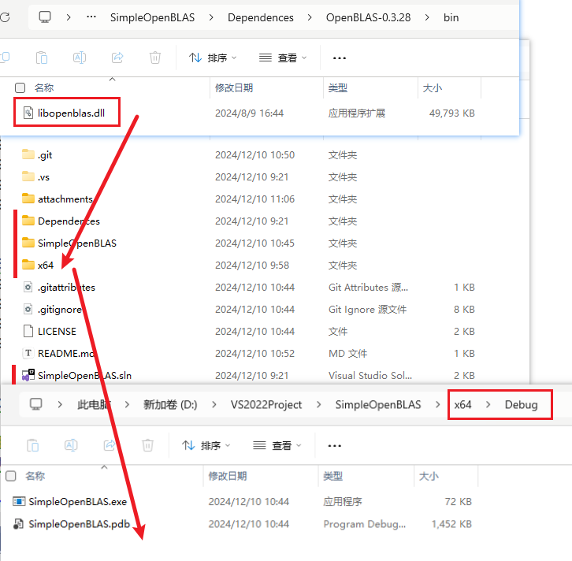

# 基于 OpenBLAS 的坐标系变换

## 任务描述

测试在**移动端**的 CPU 上，基于 OpenBLAS，一秒能完成的 **世界坐标系** 到 屏幕像素坐标系 的变换的次数。

## 环境

1. Visual Studio 2022 
2. OpenBLAS-0.3.28-x64

## 环境配置

1. 在[OpenBLAS官网](https://github.com/OpenMathLib/OpenBLAS/releases)上下载 Release 最新版本，OpenBLAS-0.3.28-x64。


2. 下载好后，创建一个 VS2022 控制台应用，创建一个文件夹，命名为 OpenBLAS-0.3.28，将压缩包解压到该文件夹下，将外面的两个文件拖入到 lib 文件夹中（也可以不拖，只是下面设置路径的时候略有不一样）。


3. 配置项目的**附加包含目录**，附加库目录和**附加依赖项**。这里的路径可根据自己的项目配置灵活修改，本项目是在解决方案下新建文件夹 Dependences（和项目同级），本意将未来所有配置文件放在该文件夹下。


4. 将 dll 配置到项目运行路径中。项目运行是在整个解决方案下的 x64 里面，而不是单个项目的 x64 里面。下面有两种方法将 dll 配置到项目运行路径中。还可参考[解决方案链接](https://www.cnblogs.com/xiaxuexiaoab/p/14948324.html)。

​	方法1：将 OpenBLAS-0.3.28/bin 文件夹下的 dll 复制到解决方案的 x64/Debug 目录下。

​	

​	方法2：在项目配置中设置调试环境。本项目设置的是 `PATH=$(SolutionDir)Dependences/OpenBLAS-0.3.28/bin`。


5. 测试编译运行。输入以下代码，能够看到控制台输出，即成功配置。

```c++
#include <iostream>
#include <chrono>
#include <cblas.h>

// 假设世界坐标到屏幕坐标的变换使用 4x4 矩阵乘法
void multiplyMatrix(const float* vMatrixA, const float* vMatrixB, float* pResultMatrixC, int vSize)
{
    cblas_sgemm(CblasColMajor, CblasNoTrans, CblasNoTrans,
        vSize, vSize, vSize, 1.0f, vMatrixA, vSize, vMatrixB, vSize, 0.0f, pResultMatrixC, vSize);
}

int main()
{
    const int MatrixSize = 4;       // 使用 4x4 矩阵
    const int Iterations = 1000000; // 每秒进行 100 万次变换

    // 创建 4x4 矩阵，初始化为单位矩阵
    float pMatrixA[MatrixSize * MatrixSize] = {
        1.0f, 0.0f, 0.0f, 0.0f,
        0.0f, 1.0f, 0.0f, 0.0f,
        0.0f, 0.0f, 1.0f, 0.0f,
        0.0f, 0.0f, 0.0f, 1.0f
    };
    float pMatrixB[MatrixSize * MatrixSize] = {
        1.0f, 0.0f, 0.0f, 0.0f,
        0.0f, 1.0f, 0.0f, 0.0f,
        0.0f, 0.0f, 1.0f, 0.0f,
        0.0f, 0.0f, 0.0f, 1.0f
    };
    float pResultMatrix[MatrixSize * MatrixSize]; // 结果矩阵

    auto StartTime = std::chrono::high_resolution_clock::now();
    for (size_t i = 0; i < Iterations; ++i) 
    {
        multiplyMatrix(pMatrixA, pMatrixB, pResultMatrix, MatrixSize); // 进行矩阵乘法运算
    }
    auto EndTime = std::chrono::high_resolution_clock::now();
    std::chrono::duration<double> Duration = EndTime - StartTime;

    double TransformsPerSecond = Iterations / Duration.count();
    std::cout << "每秒完成的变换次数: " << TransformsPerSecond << std::endl;
    return 0;
}
```


